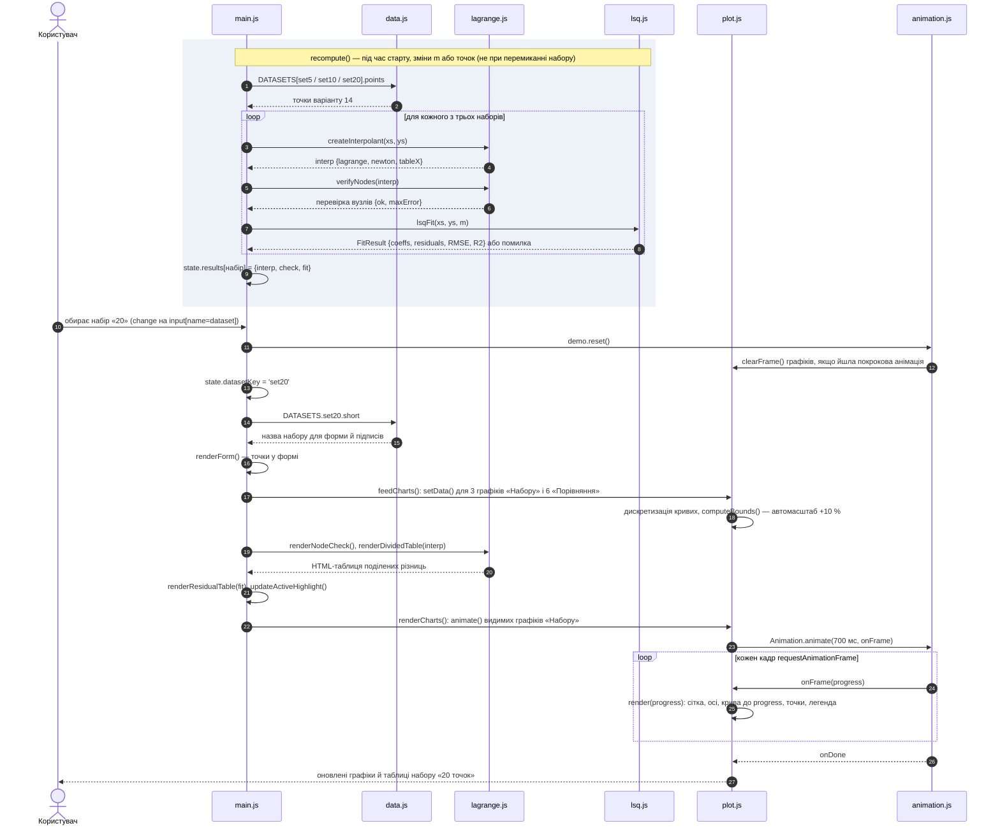
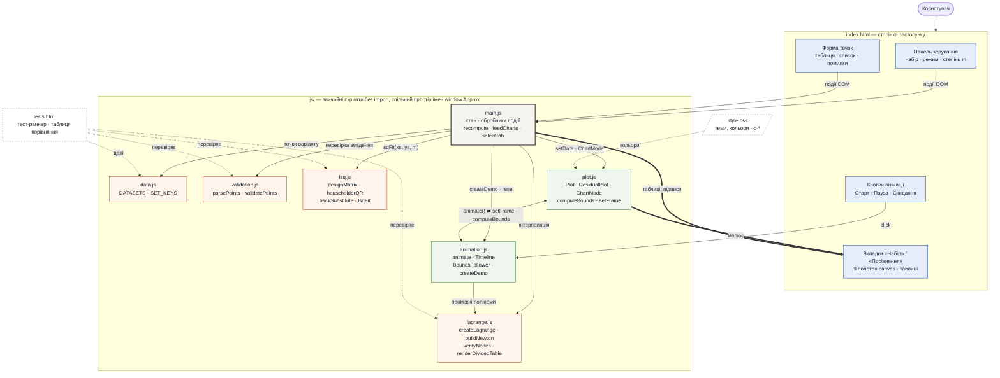

# Діаграми проєкту «Апроксимація функцій» (варіант 14)

## Послідовність: користувач обирає набір

```mermaid
sequenceDiagram
    autonumber
    actor U as Користувач
    participant M as main.js
    participant D as data.js
    participant L as lagrange.js
    participant Q as lsq.js
    participant P as plot.js
    participant A as animation.js

    rect rgba(31, 79, 163, 0.08)
    Note over M,Q: recompute() — під час старту, зміни m або точок (не при перемиканні набору)
    M->>D: DATASETS[set5 / set10 / set20].points
    D-->>M: точки варіанту 14
    loop для кожного з трьох наборів
        M->>L: createInterpolant(xs, ys)
        L-->>M: interp {lagrange, newton, tableX}
        M->>L: verifyNodes(interp)
        L-->>M: перевірка вузлів {ok, maxError}
        M->>Q: lsqFit(xs, ys, m)
        Q-->>M: FitResult {coeffs, residuals, RMSE, R2} або помилка
    end
    M->>M: state.results[набір] = {interp, check, fit}
    end

    U->>M: обирає набір «20» (change на input[name=dataset])
    M->>A: demo.reset()
    A->>P: clearFrame() графіків, якщо йшла покрокова анімація
    M->>M: state.datasetKey = 'set20'
    M->>D: DATASETS.set20.short
    D-->>M: назва набору для форми й підписів
    M->>M: renderForm() — точки у формі
    M->>P: feedCharts(): setData() для 3 графіків «Набору» і 6 «Порівняння»
    P->>P: дискретизація кривих, computeBounds() — автомасштаб +10 %
    M->>L: renderNodeCheck(), renderDividedTable(interp)
    L-->>M: HTML-таблиця поділених різниць
    M->>M: renderResidualTable(fit), updateActiveHighlight()
    M->>P: renderCharts(): animate() видимих графіків «Набору»
    P->>A: Animation.animate(700 мс, onFrame)
    loop кожен кадр requestAnimationFrame
        A->>P: onFrame(progress)
        P->>P: render(progress): сітка, осі, крива до progress, точки, легенда
    end
    A-->>P: onDone
    P-->>U: оновлені графіки й таблиці набору «20 точок»
```

## Компоненти

```mermaid
flowchart TB
    U(["Користувач"])

    subgraph PAGE["index.html — сторінка застосунку"]
        UI["Панель керування<br/>набір · режим · степінь m"]
        FORM["Форма точок<br/>таблиця · список · помилки"]
        DEMO["Кнопки анімації<br/>Старт · Пауза · Скидання"]
        TABS["Вкладки «Набір» / «Порівняння»<br/>9 полотен canvas · таблиці"]
    end

    subgraph JS["js/ — звичайні скрипти без import, спільний простір імен window.Approx"]
        MAIN["main.js<br/>стан · обробники подій<br/>recompute · feedCharts · selectTab"]
        DATA["data.js<br/>DATASETS · SET_KEYS"]
        VAL["validation.js<br/>parsePoints · validatePoints"]
        LAG["lagrange.js<br/>createLagrange · buildNewton<br/>verifyNodes · renderDividedTable"]
        LSQ["lsq.js<br/>designMatrix · householderQR<br/>backSubstitute · lsqFit"]
        PLOT["plot.js<br/>Plot · ResidualPlot · ChartMode<br/>computeBounds · setFrame"]
        ANIM["animation.js<br/>animate · Timeline<br/>BoundsFollower · createDemo"]
    end

    CSS[/"style.css<br/>теми, кольори --c-*"/]
    TESTS["tests.html<br/>тест-раннер · таблиця порівняння"]

    U --> PAGE
    UI & FORM -- "події DOM" --> MAIN
    DEMO -- "click" --> ANIM

    MAIN -- "точки варіанту" --> DATA
    MAIN -- "перевірка введення" --> VAL
    MAIN -- "інтерполяція" --> LAG
    MAIN -- "lsqFit(xs, ys, m)" --> LSQ
    MAIN -- "setData · ChartMode" --> PLOT
    MAIN -- "createDemo · reset" --> ANIM

    PLOT <-- "animate() ⇄ setFrame · computeBounds" --> ANIM
    ANIM -- "проміжні поліноми" --> LAG

    PLOT == "малює" ==> TABS
    MAIN == "таблиці, підписи" ==> TABS

    CSS -. "кольори" .-> PLOT
    TESTS -. "перевіряє" .-> LAG
    TESTS -. "перевіряє" .-> LSQ
    TESTS -. "перевіряє" .-> VAL
    TESTS -. "дані" .-> DATA

    classDef ui fill:#e6edf9,stroke:#1f4fa3,color:#1c2229
    classDef calc fill:#fff4ec,stroke:#b8461b,color:#1c2229
    classDef view fill:#eef6ee,stroke:#2e7d32,color:#1c2229
    classDef core fill:#f4f3ee,stroke:#1c2229,color:#1c2229,stroke-width:2px
    classDef aux fill:#ffffff,stroke:#8a8f96,color:#1c2229,stroke-dasharray:4 3
    class UI,FORM,TABS,DEMO ui
    class DATA,LAG,LSQ,VAL calc
    class PLOT,ANIM view
    class MAIN core
    class CSS,TESTS aux
```
